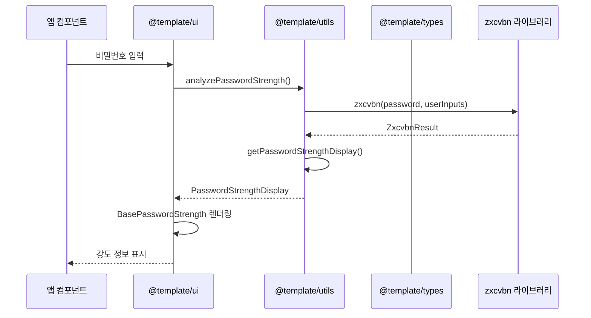
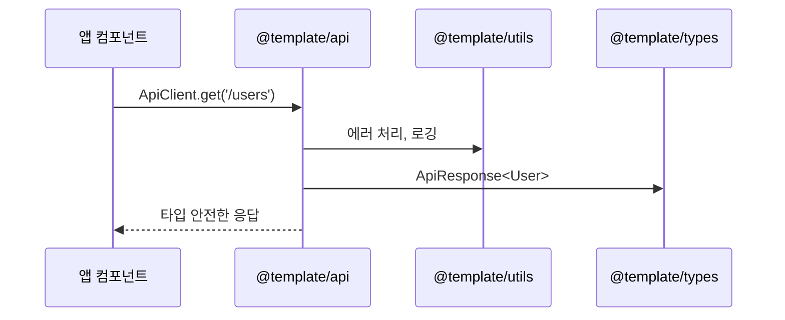
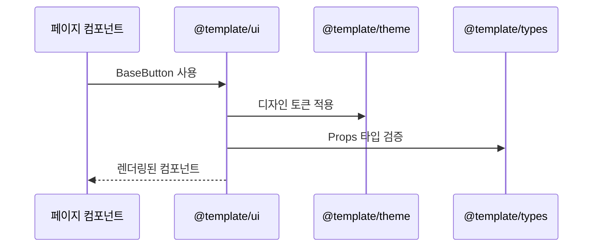

# 🏗️ 모노레포 아키텍처 가이드

Vue 3 모노레포의 패키지 구조, 데이터 흐름, 그리고 개발 가이드라인을 설명합니다.

## 📦 패키지 구조

### **패키지별 역할과 책임**

```
@template/types     # 타입 정의 (기반 패키지)
@template/utils     # 유틸리티 함수 (비즈니스 로직)
@template/api       # API 통신 (외부 서비스 연동)
@template/mocks     # API 모킹 (MSW 기반)
@template/theme     # 디자인 토큰 (스타일링)
@template/ui        # UI 컴포넌트 (재사용 가능한 컴포넌트)
```

### **의존성 관계**

```mermaid
graph TD
    A[@template/types] --> B[@template/utils]
    A --> C[@template/api]
    A --> D[@template/mocks]
    A --> E[@template/theme]
    A --> F[@template/ui]
    B --> C
    D --> C
    E --> F
    
    G[apps/desktop] --> A
    G --> B
    G --> C
    G --> D
    G --> E
    G --> F
    
    H[apps/mobile] --> A
    H --> B
    H --> C
    H --> D
    H --> E
    H --> F
    
    I[apps/sample-desktop] --> A
    I --> B
    I --> C
    I --> D
    I --> E
    I --> F
```

### **TypeScript 프로젝트 참조**

각 패키지는 TypeScript 프로젝트 참조를 통해 안전한 의존성 관리를 제공합니다:

```json
// packages/ui/tsconfig.json
{
  "references": [
    { "path": "../types" }
  ]
}

// apps/desktop/tsconfig.json
{
  "references": [
    { "path": "../../packages/types" },
    { "path": "../../packages/utils" },
    { "path": "../../packages/api" },
    { "path": "../../packages/ui" }
  ]
}
```

### **패키지 선택 기준**

| 기능 유형 | 적합한 패키지 | 예시 |
|-----------|---------------|------|
| 타입 정의 | `@template/types` | API 응답 타입, 컴포넌트 Props 타입 |
| 순수 함수 | `@template/utils` | 날짜 포맷팅, 검증 로직, 암호화 |
| 외부 API | `@template/api` | HTTP 클라이언트, API 서비스 |
| API 모킹 | `@template/mocks` | MSW 핸들러, 모킹 데이터 |
| 디자인 시스템 | `@template/theme` | 색상, 폰트, 간격 토큰 |
| UI 컴포넌트 | `@template/ui` | 버튼, 입력 필드, 테이블 |

## 🔄 패키지 간 데이터 흐름

### **비밀번호 강도 기능 예시**



### **API 통신 흐름**



### **UI 컴포넌트 데이터 흐름**



## 🎯 사용 시나리오

### **시나리오 1: 회원가입 페이지**

```vue
<!-- apps/desktop/src/views/SignUpView.vue -->
<template>
  <div class="signup-form">
    <!-- @template/ui 패키지 사용 -->
    <BaseInput v-model="form.email" label="이메일" />
    <BaseInputPassword 
      v-model="form.password"
      :user-inputs="[form.email, form.firstName]"
      @strength-change="handleStrengthChange"
    />
    <BaseButton @click="handleSubmit">가입하기</BaseButton>
  </div>
</template>

<script setup lang="ts">
// @template/types 패키지 사용
import type { User, PasswordStrengthDisplay } from '@template/types'

// @template/utils 패키지 사용
import { isPasswordStrongEnough } from '@template/utils'

// @template/api 패키지 사용
import { ApiClient } from '@template/api'

// @template/ui 패키지 사용
import { BaseInput, BaseInputPassword, BaseButton } from '@template/ui'
</script>
```

### **시나리오 2: 비밀번호 변경**

```vue
<!-- apps/desktop/src/views/ChangePasswordView.vue -->
<template>
  <div class="change-password">
    <BaseInputPassword 
      v-model="newPassword"
      :show-strength="true"
      :user-inputs="[user.email, user.firstName]"
    />
  </div>
</template>

<script setup lang="ts">
import { usePasswordStrength } from '@template/ui'
import { getPasswordRecommendations } from '@template/utils'

const { strength, isValid } = usePasswordStrength(newPassword.value, [user.email])
</script>
```

### **시나리오 3: 관리자 설정**

```vue
<!-- apps/desktop/src/views/AdminSettingsView.vue -->
<template>
  <div class="admin-settings">
    <BaseTable :data="users" :columns="columns" />
    <BasePagination :total="total" :current="current" />
  </div>
</template>

<script setup lang="ts">
import { ApiClient } from '@template/api'
import { BaseTable, BasePagination } from '@template/ui'
import type { User, PaginatedResponse } from '@template/types'
</script>
```

## 📋 개발 가이드라인

### **새 기능 추가 시 패키지 선택 기준**

1. **타입 정의가 필요한가?** → `@template/types`
2. **순수 함수인가?** → `@template/utils`
3. **외부 API 연동인가?** → `@template/api`
4. **디자인 토큰인가?** → `@template/theme`
5. **재사용 가능한 UI인가?** → `@template/ui`

### **패키지 추가 가이드**

새 패키지를 추가할 때는 다음 단계를 따르세요:

1. **패키지 디렉토리 생성**
2. **package.json 설정**
3. **TypeScript 설정 파일 생성** (tsconfig.json, tsconfig.build.json)
4. **루트 설정 업데이트** (tsconfig.base.json)
5. **의존성 패키지에 참조 추가**
6. **빌드 및 테스트**

자세한 내용은 [패키지 관리 가이드](./package-management.md)를 참조하세요.

### **컴포넌트 설계 원칙**

1. **단일 책임**: 각 컴포넌트는 하나의 명확한 역할만
2. **재사용성**: 여러 곳에서 사용할 수 있도록 설계
3. **타입 안전성**: TypeScript를 적극 활용
4. **테스트 가능성**: 단위 테스트 작성 가능하도록 설계

### **데이터 흐름 설계 원칙**

1. **단방향 흐름**: 데이터는 위에서 아래로만 흐름
2. **명확한 인터페이스**: Props와 Emits를 명확히 정의
3. **타입 안전성**: 모든 데이터 전달에 타입 정의
4. **에러 처리**: 각 단계에서 적절한 에러 처리

### **테스트 전략**


## 🔗 관련 문서

- [패키지 관리 가이드](./package-management.md)
- [순환 의존성 방지](./circular-dependency-prevention.md)
- [Figma 설정](./figma-setup.md)
- [모바일 배포](./mobile-deployment.md)
- [Mermaid 가이드라인](./mermaid-guidelines.mdc)

## 📝 참고 자료

- [Vue 3 Composition API](https://vuejs.org/guide/extras/composition-api-faq.html)
- [TypeScript 모노레포 가이드](https://www.typescriptlang.org/docs/handbook/project-references.html)
- [PNPM 워크스페이스](https://pnpm.io/workspaces) 