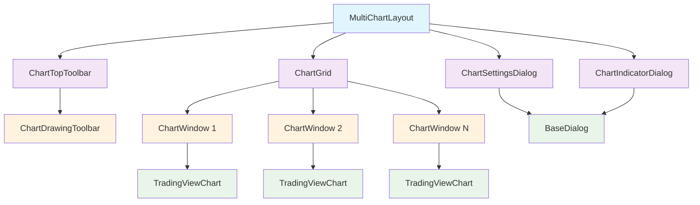
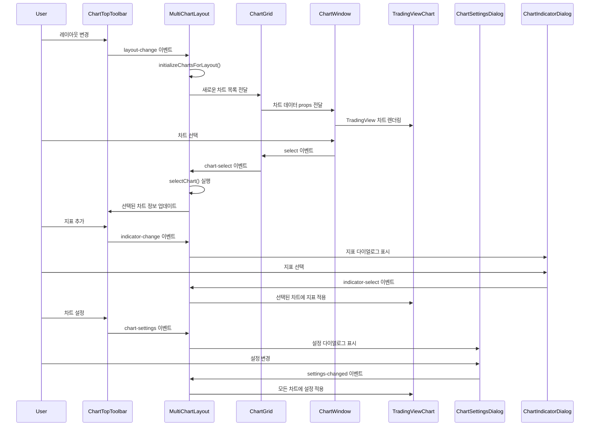

# 차트 컴포넌트 구조 설계 문서

## 개요

다중 차트 레이아웃 시스템의 핵심 컴포넌트 구조와 설계사항을 문서화합니다.

> 💡 **용어 사전**: 차트 관련 개발에서 사용되는 핵심 용어들에 대한 가이드는 [Chart Terms](./chart-terms.md)를 참조하세요.

## 컴포넌트 계층 구조

```
MultiChartLayout (최상위 컨테이너)
├── ChartTopToolbar (상단 툴바)
│   └── ChartDrawingToolbar (좌측 드로잉 툴바)
├── ChartGrid (차트 그리드 컨테이너)
│   └── ChartWindow[] (개별 차트 윈도우들)
│       └── TradingViewChart (TradingView 차트 위젯)
├── ChartSettingsDialog (차트 설정 다이얼로그)
└── ChartIndicatorDialog (차트 지표 다이얼로그)
```

### 컴포넌트 관계도



### 데이터 흐름도



## 1. MultiChartLayout.vue

### 역할
- **최상위 컨테이너**: 전체 다중 차트 레이아웃의 메인 컴포넌트
- **상태 관리**: `charts` (차트 목록), `selectedChart` (선택된 차트 ID), `currentLayout` (현재 레이아웃), `showSettingsDialog` (설정 다이얼로그 표시 여부), `showIndicatorDialog` (지표 다이얼로그 표시 여부) 등 핵심 상태를 관리합니다.
- **차트 생명주기 관리**: `addChart`, `removeChart`, `initializeChartsForLayout` 함수를 통해 차트의 추가, 제거, 초기화를 담당합니다.
- **이벤트 핸들링**: 하위 컴포넌트에서 발생하는 이벤트를 수신하고, 필요한 로직을 처리하거나 상위로 이벤트를 전달합니다.
- **ChartManager 접근**: `getSelectedChartManager` 메서드를 통해 선택된 `ChartWindow`의 `ChartManager` 인스턴스에 접근할 수 있도록 합니다.

### Props
| 속성 | 타입 | 기본값 | 설명 |
|------|------|--------|------|
| `initialSymbols` | `TradingSymbol[]` | `[]` | 초기 심볼 목록 |

### Emits
| 이벤트 | 페이로드 | 설명 |
|--------|----------|------|
| `chart-select` | `ChartData` | 차트 선택 시 발생 |
| `symbol-change` | `TradingSymbol` | 심볼 변경 시 발생 |

### Exposed Methods
| 메서드 | 반환 타입 | 설명 |
|--------|-----------|------|
| `addNewChart(symbol)` | `void` | 새 차트 추가 |
| `removeChartById(chartId)` | `void` | 차트 제거 |
| `changeSelectedChartSymbol(symbol)` | `void` | 선택된 차트의 심볼 변경 |
| `getSelectedChartId()` | `string \| null` | 선택된 차트 ID 반환 |
| `getCharts()` | `ChartData[]` | 차트 목록 반환 |
| `selectedChartData` | `ChartData \| null` | 선택된 차트 데이터 (computed) |
| `getSelectedChartManager()` | `ChartManager \| null` | 선택된 차트의 ChartManager 반환 |

## 2. ChartDrawingToolbar.vue

### 역할
- **좌측 드로잉 툴바**: 차트 관련 도구 버튼들을 표시합니다.
- **이벤트 발생**: 각 버튼 클릭 시 해당 이벤트를 상위 컴포넌트(`MultiChartLayout`)로 전달합니다.

### Emits
| 이벤트 | 페이로드 | 설명 |
|--------|----------|------|
| `add-chart` | - | 차트 추가 요청 |
| `chart-eye` | - | 차트 보기 설정 |
| `chart-setup` | - | 차트 설정 |

## 3. ChartTopToolbar.vue

### 역할
- **상단 툴바**: 차트의 전역적인 설정(시간대, 지표, 레이아웃, 워크스페이스, 차트 설정 다이얼로그)을 제어하는 UI를 제공합니다.
- **이벤트 발생**: 사용자 상호작용에 따라 `MultiChartLayout`으로 이벤트를 전달합니다.
- **드로잉 툴바 관리**: `ChartDrawingToolbar`을 포함하고, 이들의 표시 상태를 관리합니다.

### Props
| 속성 | 타입 | 기본값 | 설명 |
|------|------|--------|------|
| `selectedChart` | `string \| null` | `undefined` | 선택된 차트 ID |

### Emits
| 이벤트 | 페이로드 | 설명 |
|--------|----------|------|
| `timeframe-change` | `string` | 시간대 변경 |
| `indicator-change` | `string` | 지표 변경 |
| `layout-change` | `ChartLayout` | 레이아웃 변경 |
| `chart-manage` | - | 차트 관리 |
| `chart-eye` | - | 차트 보기 |
| `chart-setup` | - | 차트 설정 |
| `chart-settings` | - | 차트 설정 다이얼로그 |
| `workspace-save` | - | 워크스페이스 저장 |

## 4. ChartGrid.vue

### 역할
- **차트 그리드 컨테이너**: `MultiChartLayout`으로부터 받은 `charts` 데이터를 기반으로 여러 `ChartWindow` 컴포넌트를 그리드 형태로 배치합니다.
- **레이아웃 적용**: `getGridLayoutClass` 유틸리티 함수를 사용하여 현재 `layout`에 맞는 CSS 그리드 클래스를 적용합니다.
- **차트 정렬**: `sortChartsByPosition` 유틸리티 함수를 사용하여 차트를 위치별로 정렬하여 렌더링합니다.
- **이벤트 중계**: `ChartWindow`에서 발생하는 `select`, `close`, `sync` 이벤트를 수신하여 `MultiChartLayout`으로 전달합니다.
- **ChartWindow Ref 노출**: `getChartWindowRef` 메서드를 통해 개별 `ChartWindow` 컴포넌트의 ref에 접근할 수 있도록 합니다.

### Props
| 속성 | 타입 | 설명 |
|------|------|------|
| `charts` | `ChartData[]` | 차트 목록 |
| `selectedChart` | `string \| null` | 선택된 차트 ID |
| `layout` | `ChartLayout` | 현재 레이아웃 |

### Emits
| 이벤트 | 페이로드 | 설명 |
|--------|----------|------|
| `chart-select` | `string` | 차트 선택 |
| `chart-close` | `string` | 차트 닫기 |
| `chart-sync` | `string, string` | 차트 동기화 (chartId, syncColor) |

### Exposed Methods
| 메서드 | 반환 타입 | 설명 |
|--------|-----------|------|
| `getChartWindowRef(chartId)` | `ComponentRef \| null` | 특정 차트 윈도우 ref 반환 |
| `getChartManager(chartId)` | `ChartManager \| null` | 특정 차트의 ChartManager 반환 |

## 5. ChartWindow.vue

### 역할
- **개별 차트 윈도우**: 하나의 TradingView 차트를 표시하는 컨테이너입니다.
- **차트 헤더/컨트롤**: 심볼 정보, 시간대, 동기화 색상, 외부 링크, 닫기 버튼 등 차트별 UI 요소를 포함합니다.
- **TradingViewChart 렌더링**: 실제 TradingView 위젯을 렌더링하는 `TradingViewChart` 컴포넌트를 포함합니다.
- **이벤트 발생**: 선택, 닫기, 동기화 색상 선택 등 사용자 상호작용에 따라 이벤트를 상위 컴포넌트(`ChartGrid`)로 전달합니다.
- **ChartManager 노출**: `getChartManager` 메서드를 통해 내부 `TradingViewChart` 컴포넌트의 `ChartManager` 인스턴스를 노출합니다.

### Props
| 속성 | 타입 | 설명 |
|------|------|------|
| `chart` | `ChartData` | 차트 데이터 |
| `isSelected` | `boolean` | 선택 상태 |

### Emits
| 이벤트 | 페이로드 | 설명 |
|--------|----------|------|
| `select` | - | 차트 선택 |
| `close` | - | 차트 닫기 |
| `sync` | `string` | 동기화 색상 선택 |
| `external-link` | - | 외부 링크 |
| `previous` | - | 이전 |
| `next` | - | 다음 |
| `symbol-change` | `TradingSymbol` | 심볼 변경 |
| `timeframe-change` | `string` | 시간대 변경 |

### Exposed Methods
| 메서드 | 반환 타입 | 설명 |
|--------|-----------|------|
| `getChartManager()` | `ChartManager \| null` | ChartManager 인스턴스 반환 |

## 6. TradingViewChart.vue

### 역할
- **TradingView 차트 위젯**: TradingView 라이브러리를 사용하여 실제 차트를 렌더링하는 컴포넌트
- **ChartManager 관리**: 차트의 초기화, 데이터 업데이트, 설정 관리를 담당하는 ChartManager 인스턴스를 생성하고 관리
- **차트 생명주기**: 차트 생성, 업데이트, 제거의 전체 생명주기를 관리
- **이벤트 발생**: 차트 준비 완료 시 상위 컴포넌트에 알림

### Props
| 속성 | 타입 | 설명 |
|------|------|------|
| `symbol` | `string` | 차트 심볼 |
| `chartId` | `string` | 차트 고유 ID |
| `isDialogOpen` | `boolean` | 다이얼로그 열림 상태 |

### Emits
| 이벤트 | 페이로드 | 설명 |
|--------|----------|------|
| `chart-ready` | - | 차트 준비 완료 |

### Exposed Methods
| 메서드 | 반환 타입 | 설명 |
|--------|-----------|------|
| `getChartManager()` | `ChartManager \| null` | ChartManager 인스턴스 반환 |

## 7. ChartSettingsDialog.vue

### 역할
- **차트 설정 다이얼로그**: 모든 차트 설정을 탭별로 세밀하게 조정할 수 있는 모달 다이얼로그입니다.
- **BaseDialog 사용**: `BaseDialog` 컴포넌트를 사용하여 일관된 다이얼로그 UI를 제공합니다.
- **설정 적용**: 사용자가 변경한 설정을 모든 차트에 전역적으로 적용합니다.

### Props
| 속성 | 타입 | 설명 |
|------|------|------|
| `isVisible` | `boolean` | 다이얼로그 표시 여부 |
| `chartManager` | `any` | 차트 매니저 인스턴스 |

### Emits
| 이벤트 | 페이로드 | 설명 |
|--------|----------|------|
| `close` | - | 다이얼로그 닫기 |
| `settings-changed` | `ChartSettings` | 설정 변경 시 발생 |

### 설정 탭
- **기본 탭**: 테마, 가격 정밀도, 타임존
- **심볼 및 지표 탭**: 종목명, 차트 값, 봉 변화값, 지표 표시 옵션
- **축 및 눈금선 탭**: 가격 라벨, 격자선, 십자선 설정
- **트레이딩 탭**: 매수/매도 버튼, 주문 표시

## 8. ChartIndicatorDialog.vue

### 역할
- **차트 지표 선택 다이얼로그**: 차트에 추가할 지표를 선택할 수 있는 모달 다이얼로그입니다.
- **BaseDialog 사용**: `BaseDialog` 컴포넌트를 사용하여 일관된 다이얼로그 UI를 제공합니다.
- **지표 검색**: 지표명으로 검색할 수 있는 기능을 제공합니다.
- **카테고리별 분류**: 지표를 카테고리별로 분류하여 표시합니다.

### Props
| 속성 | 타입 | 설명 |
|------|------|------|
| `isVisible` | `boolean` | 다이얼로그 표시 여부 |
| `selectedChartId` | `string \| null` | 선택된 차트 ID |

### Emits
| 이벤트 | 페이로드 | 설명 |
|--------|----------|------|
| `close` | - | 다이얼로그 닫기 |
| `indicator-select` | `Indicator` | 지표 선택 시 발생 |

### 지표 카테고리
- **기술적 지표**: 24시간 거래량, BBTrend, MA 크로스, 가격 목표 등
- **추세 지표**: MACD, RSI, 스토캐스틱
- **오실레이터**: Williams %R, CCI

## 9. BaseDialog.vue

### 역할
- **다이얼로그 베이스 컴포넌트**: 모든 차트 관련 다이얼로그의 공통 기능을 제공합니다.
- **일관된 UI**: Headless UI의 Dialog 컴포넌트를 사용하여 일관된 다이얼로그 UI를 제공합니다.
- **접근성**: ESC 키, 오버레이 클릭, 포커스 관리 등 접근성 기능을 제공합니다.

### Props
| 속성 | 타입 | 기본값 | 설명 |
|------|------|--------|------|
| `isVisible` | `boolean` | - | 다이얼로그 표시 여부 |
| `title` | `string` | - | 다이얼로그 제목 |
| `size` | `'sm' \| 'md' \| 'lg' \| 'xl'` | `'md'` | 다이얼로그 크기 |

### Emits
| 이벤트 | 페이로드 | 설명 |
|--------|----------|------|
| `close` | - | 다이얼로그 닫기 |

### Slots
| 슬롯 | 설명 |
|------|------|
| `default` | 다이얼로그 메인 컨텐츠 |
| `footer` | 다이얼로그 푸터 (선택사항) |

## 사용 예시

### 기본 사용법

```vue
<template>
  <MultiChartLayout
    :initial-symbols="defaultSymbols"
    @chart-select="handleChartSelect"
    @symbol-change="handleSymbolChange"
  />
</template>

<script setup lang="ts">
import { MultiChartLayout } from '@/components/chart';
import { DEFAULT_FOREX_SYMBOLS } from '@template/types';
import type { ChartData, TradingSymbol } from '@template/types';

const defaultSymbols = DEFAULT_FOREX_SYMBOLS.slice(0, 4);

const handleChartSelect = (chart: ChartData) => {
  console.log('선택된 차트:', chart);
};

const handleSymbolChange = (symbol: TradingSymbol) => {
  console.log('심볼 변경:', symbol);
};
</script>
```

### 프로그래밍 방식 제어

```vue
<template>
  <MultiChartLayout ref="chartLayoutRef" />
  <button @click="addChart">차트 추가</button>
  <button @click="removeChart">차트 제거</button>
  <button @click="getChartManager">차트 매니저 가져오기</button>
</template>

<script setup lang="ts">
import { ref } from 'vue';
import { MultiChartLayout } from '@/components/chart';
import { DEFAULT_FOREX_SYMBOLS } from '@template/types';
import type { TradingSymbol } from '@template/types';

const chartLayoutRef = ref();

const addChart = () => {
  const symbol: TradingSymbol = DEFAULT_FOREX_SYMBOLS[0];
  chartLayoutRef.value?.addNewChart(symbol);
};

const removeChart = () => {
  const selectedId = chartLayoutRef.value?.getSelectedChartId();
  if (selectedId) {
    chartLayoutRef.value?.removeChartById(selectedId);
  }
};

const getChartManager = () => {
  const manager = chartLayoutRef.value?.getSelectedChartManager();
  console.log('선택된 차트 매니저:', manager);
};
</script>
```

## 결론

이 컴포넌트들은 명확한 계층 구조와 단일 책임 원칙을 따르며, 확장 가능하고 유지보수가 용이한 구조로 설계되었습니다. 각 컴포넌트는 독립적으로 테스트 가능하며, 타입 안전성을 통해 개발 생산성을 향상시킵니다.

### 주요 설계 원칙

1. **단일 책임 원칙**: 각 컴포넌트는 하나의 명확한 역할을 담당
2. **의존성 역전**: 상위 컴포넌트가 하위 컴포넌트를 제어
3. **이벤트 기반 통신**: Props down, Events up 패턴
4. **타입 안전성**: TypeScript를 활용한 컴파일 타임 오류 방지
5. **재사용성**: 공통 타입과 유틸리티 함수의 모듈화
6. **일관성**: BaseDialog를 통한 일관된 다이얼로그 UI
7. **분리**: 각 다이얼로그가 독립적으로 존재하여 재사용성 향상