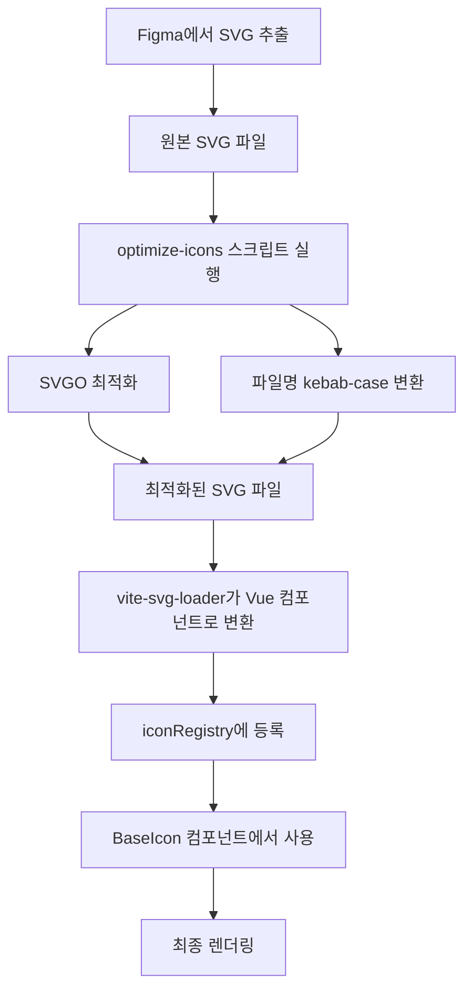

# 아이콘 최적화 프로세스 가이드

UI 패키지에서 사용하는 아이콘 시스템의 최적화 프로세스와 사용법을 설명합니다.

## 📋 개요

UI 패키지는 Figma에서 추출한 SVG 아이콘을 최적화하고, 타입 안전한 Vue 컴포넌트로 변환하여 사용하는 시스템을 제공합니다.

## 🔄 전체 워크플로우



## 🚀 1. Figma에서 SVG 추출

### 1.1 Figma에서 아이콘 내보내기
- Figma에서 아이콘 컴포넌트를 선택
- 우클릭 → "Export" 선택
- Format: SVG 선택
- 원본 파일명은 Figma의 컴포넌트명을 따름 (예: `Arrow Forward`, `Account Balance` 등)

### 1.2 파일 위치
```
packages/ui/src/assets/icons/
├── account-balance.svg
├── account.svg
├── add-symbol.svg
├── arrow-backward-sm.svg
├── arrow-backward.svg
├── arrow-close.svg
├── arrow-down-solid.svg
├── arrow-down.svg
├── arrow-drawer.svg
├── arrow-forward-sm.svg
├── arrow-forward.svg
├── arrow-left-solid.svg
├── arrow-open.svg
├── arrow-outward.svg
├── arrow-right-solid.svg
├── arrow-right-thin.svg
├── arrow-up-solid.svg
├── arrow-up.svg
├── arrow-updown-solid.svg
├── arrow-updown.svg
├── asset.svg
├── calendar.svg
├── campaign-thin.svg
├── card.svg
├── cert.svg
├── chart-1-d.svg
├── chart-1-w.svg
├── chart-15m.svg
├── chart-1h.svg
├── chart-1m.svg
├── chart-30m.svg
├── chart-4h.svg
├── chart-5m.svg
├── chart-area.svg
├── chart-bubble.svg
├── chart-candle.svg
├── chart-eye-thin.svg
├── chart-indicator.svg
├── chart-line.svg
├── chart-new.svg
├── chart-setting.svg
├── chart-setup.svg
├── chart-snapshot.svg
├── chart.svg
├── check-circle.svg
├── check-sm.svg
├── close small.svg
├── close-thin.svg
├── close.svg
├── cloud-upload.svg
├── comm.svg
├── copy.svg
├── delete.svg
├── deposit-thin.svg
├── description.svg
├── dollar.svg
├── download.svg
├── drag-draw.svg
├── edit.svg
├── email.svg
├── external-link.svg
├── eye-close.svg
├── eye.svg
├── faq-thin.svg
├── fav.svg
├── favorite.svg
├── file-attached.svg
├── filter.svg
├── fullscreen.svg
├── grab.svg
├── grade.svg
├── heart-thin.svg
├── heart.svg
├── home.svg
├── icn-delete.svg
├── info-thin.svg
├── info.svg
├── layout-1x1.svg
├── layout-2x2.svg
├── layout-3x3.svg
├── layout-4x4.svg
├── list-thin.svg
├── list.svg
├── login.svg
├── logout-thin.svg
├── logout.svg
├── minus.svg
├── mode-dark.svg
├── mode-light.svg
├── more vert.svg
├── move.svg
├── mypage-thin.svg
├── mypage.svg
├── noti.svg
├── order.svg
├── pause.svg
├── person.svg
├── phone.svg
├── plus-minus.svg
├── plus.svg
├── refresh.svg
├── save.svg
├── screen-multi.svg
├── screen-multi2.svg
├── screen-single.svg
├── search.svg
├── send.svg
├── settings.svg
├── sort.svg
├── star.svg
├── support-thin.svg
├── support.svg
├── time.svg
├── trade-thin.svg
├── trade.svg
├── transparent.svg
├── trash-thin.svg
├── trash.svg
├── trending-down.svg
├── trending-up.svg
├── upload.svg
├── warning.svg
├── warning2.svg
├── watch.svg
├── withdraw.svg
└── flags/
    ├── flag-AU.svg
    ├── flag-CA.svg
    ├── flag-CN.svg
    ├── flag-de.svg
    ├── flag-es.svg
    ├── flag-EU.svg
    ├── flag-fr.svg
    ├── flag-HK.svg
    ├── flag-it.svg
    ├── flag-JP.svg
    ├── flag-KR.svg
    ├── flag-MX.svg
    ├── flag-nl.svg
    ├── flag-NR.svg
    ├── flag-NZ.svg
    ├── flag-SE.svg
    ├── flag-SG.svg
    ├── flag-SUI.svg
    ├── flag-TR.svg
    ├── flag-UK.svg
    ├── flag-US.svg
    └── flag-ZA.svg
```

## ⚙️ 2. 아이콘 최적화 스크립트 실행

### 2.1 스크립트 실행
```bash
# 루트 디렉토리에서 실행
pnpm optimize-icons
```

### 2.2 스크립트 위치
```
shared/scripts/optimize-icons.ts
```

### 2.3 주요 기능

#### SVGO 최적화
- 불필요한 속성 제거 (`width`, `height`, `fill`, `stroke`)
- 코드 압축 및 최적화
- 평균 20-30% 파일 크기 감소

#### 파일명 정규화
- **kebab-case 변환**: `Arrow Forward` → `arrow-forward`
- **특별 처리**: 
  - 플래그 아이콘: `flag--k-r` → `flag-kr`
  - 특수 케이스: `flag--s-u-i` → `flag-sui`

#### 타입별 최적화
```typescript
// 일반 아이콘용 설정 (fill, stroke 제거)
const regularSvgConfig = {
  plugins: [
    {
      name: 'removeAttrs',
      params: {
        attrs: ['width', 'height', 'fill', 'stroke'],
      },
    },
  ],
};

// 플래그 아이콘용 설정 (fill, stroke 유지)
const flagSvgConfig = {
  plugins: [
    {
      name: 'removeAttrs',
      params: {
        attrs: ['width', 'height'], // fill, stroke는 제거하지 않음
      },
    },
  ],
};
```

### 2.4 사용 라이브러리
- **SVGO**: SVG 최적화
- **kebab-case**: 파일명 변환

## 🤖 3. AI 프롬프트 (스크립트 실행 후 수행)

### 3.1 프롬프트 1: 아이콘 타입 정의 업데이트
```
@icons.ts 
@icons/ 내 파일 확인해서 IconName 추가하고, 각 SVG 파일들 내 path 확인해서 fill로 구성된 경우 fill, stroke로 구성된 경우 stroke로 아이콘 타입 매핑도 추가해줘
```

### 3.2 프롬프트 2: 가이드 문서 업데이트
```
@icon-optimization.md 추가된 아이콘들 반영해서 가이드도 업데이트해줘
```

## 🔧 4. Vite SVG Loader 설정

### 4.1 설정 위치
```
packages/ui/vite.config.ts
```

### 4.2 설정 내용
```typescript
import svgLoader from 'vite-svg-loader';

export default defineConfig({
  plugins: [
    svgLoader({
      svgo: false, // 이미 최적화된 SVG이므로 추가 최적화 비활성화
      defaultImport: 'component', // Vue 컴포넌트로 import
    }),
  ],
});
```

## 📋 5. 아이콘 레지스트리 시스템

### 5.1 레지스트리 파일
```
packages/ui/src/components/BaseIcon/iconRegistry.ts
```

### 5.2 동적 import 시스템
```typescript
// 일반 아이콘들
const iconModules = import.meta.glob('../../assets/icons/*.svg', { eager: true });

// 플래그 아이콘들
const flagModules = import.meta.glob('../../assets/icons/flags/*.svg', { eager: true });

// 아이콘 이름을 키로 하는 매핑 생성
export const iconRegistry = new Map<string, any>();

// 아이콘 등록
Object.entries(iconModules).forEach(([path, module]) => {
  const name = path.split('/').pop()?.replace('.svg', '');
  if (name) {
    iconRegistry.set(name, (module as any).default);
  }
});
```

## 🏷️ 6. 타입 시스템

### 6.1 타입 정의 파일
```
packages/ui/src/types/icons.ts
```

### 6.2 IconName 타입
```typescript
export type IconName =
  // 화살표 아이콘
  | 'arrow-forward'
  | 'arrow-backward'
  | 'arrow-up'
  | 'arrow-down'
  // ... 기타 아이콘들
  | 'flag-kr'
  | 'flag-us';
```

### 6.3 IconType 매핑
```typescript
export type IconType = 'fill' | 'stroke';

export const ICON_TYPES: Record<IconName, IconType> = {
  'arrow-forward': 'fill',
  'arrow-up': 'stroke',
  'home': 'fill',
  // ... 각 아이콘의 기본 타입 정의
};
```

## 🎨 7. BaseIcon 컴포넌트

### 7.1 컴포넌트 파일
```
packages/ui/src/components/BaseIcon/BaseIcon.vue
```

### 7.2 주요 기능

#### Props
```typescript
interface Props {
  name: IconName;           // 아이콘 이름
  size?: 'xs' | 'sm' | 'md' | 'lg' | 'xl' | number; // 크기
  color?: string;           // 색상
  className?: string;           // 추가 클래스
}
```

#### 크기 시스템
```scss
.icon-xs { width: 0.75rem; height: 0.75rem; }  // w-3
.icon-sm { width: 1rem; height: 1rem; }        // w-4
.icon-md { width: 1.5rem; height: 1.5rem; }    // w-6
.icon-lg { width: 2rem; height: 2rem; }        // w-8
.icon-xl { width: 3rem; height: 3rem; }        // w-12
```

#### 타입별 스타일링
```scss
.icon-fill {
  fill: currentColor;
  stroke: none;
}

.icon-stroke {
  stroke: currentColor;
  fill: none;
}
```

## 💻 8. 사용법

### 8.1 기본 사용법
```vue
<template>
  <!-- 기본 아이콘 -->
  <BaseIcon name="home" />
  
  <!-- 크기 지정 -->
  <BaseIcon name="settings" size="lg" />
  
  <!-- 색상 지정 -->
  <BaseIcon name="heart" color="#ff0000" />
  
  <!-- Tailwind 클래스 사용 -->
  <BaseIcon name="check" class="text-green-500" />
  
  <!-- 플래그 아이콘 -->
  <BaseIcon name="flag-kr" size="xl" />
</template>

<script setup lang="ts">
import { BaseIcon } from '@template/ui'
</script>
```

### 8.2 크기 옵션
```vue
<template>
  <!-- 미리 정의된 크기 -->
  <BaseIcon name="plus" size="xs" />
  <BaseIcon name="plus" size="sm" />
  <BaseIcon name="plus" size="md" />
  <BaseIcon name="plus" size="lg" />
  <BaseIcon name="plus" size="xl" />
  
  <!-- 커스텀 크기 -->
  <BaseIcon name="plus" :size="32" />
</template>
```

### 8.3 색상 커스터마이징
```vue
<template>
  <!-- CSS 색상 값 -->
  <BaseIcon name="heart" color="#ff0000" />
  <BaseIcon name="star" color="rgb(255, 215, 0)" />
  
  <!-- Tailwind 클래스 -->
  <BaseIcon name="check" class="text-green-500" />
  <BaseIcon name="warning" class="text-yellow-500" />
  
  <!-- 현재 색상 상속 -->
  <BaseIcon name="edit" class="text-blue-500 hover:text-blue-700" />
</template>
```

### 8.4 이벤트 처리
```vue
<template>
  <BaseIcon 
    name="close" 
    @click="handleClose" 
    class="cursor-pointer hover:opacity-75" 
  />
</template>

<script setup lang="ts">
const handleClose = () => {
  console.log('닫기 버튼 클릭')
}
</script>
```

## 🔍 9. 사용 가능한 아이콘 목록

### 9.1 화살표 아이콘
- `arrow-forward`, `arrow-backward`
- `arrow-up`, `arrow-down`
- `arrow-close`, `arrow-open`
- `arrow-drawer`, `arrow-right-thin`
- `arrow-updown`, `arrow-forward-sm`, `arrow-backward-sm`
- `arrow-down-solid`, `arrow-left-solid`, `arrow-outward`
- `arrow-right-solid`, `arrow-up-solid`, `arrow-updown-solid`

### 9.2 액션 아이콘
- `heart`, `heart-thin`, `star`
- `plus`, `minus`, `plus-minus`
- `edit`, `trash`, `refresh`
- `search`, `eye`, `eye-close`, `fullscreen`
- `external-link`, `icn-delete`, `delete`
- `copy`, `download`, `upload`
- `send`, `pause`, `move`, `withdraw`
- `save`, `sort`, `grab`, `drag-draw`

### 9.3 네비게이션 아이콘
- `home`, `settings`, `person`
- `login`, `logout`, `mypage`
- `order`, `trade`, `support`
- `list`, `phone`, `noti`
- `campaign-thin`, `deposit-thin`, `faq-thin`
- `logout-thin`, `mypage-thin`, `support-thin`
- `trade-thin`, `trash-thin`, `info-thin`
- `close-thin`, `list-thin`

### 9.4 테마 아이콘
- `mode-dark`, `mode-light`

### 9.5 상태/알림 아이콘
- `warning`, `warning2`, `info`
- `check-sm`, `check-circle`, `grade`
- `fav`, `favorite`

### 9.6 화면/디스플레이 아이콘
- `screen-single`, `screen-multi`, `screem-multi2`
- `layout-1x1`, `layout-2x2`, `layout-3x3`, `layout-4x4`

### 9.7 차트 아이콘
- `chart`, `chart-line`, `chart-candle`
- `chart-bubble`, `chart-area`
- `chart-5m`, `chart-4h`, `chart-1-w`
- `chart-1-mon`, `chart-1m`, `chart-1h`
- `chart-1-d`, `chart-15m`, `chart-30m`, `chart-10m`
- `chart-eye-thin`, `chart-indicator`, `chart-new`
- `chart-setting`, `chart-setup`, `chart-snapshot`

### 9.8 기타 아이콘
- `asset`, `calendar`, `account`, `account-balance`
- `email`, `time`, `cert`, `comm`
- `description`, `file-attached`, `filter`
- `card`, `close`, `close small`
- `trending-up`, `trending-down`
- `dollar`, `cloud-upload`, `transparent`, `watch`
- `more vert`, `add-symbol`

### 9.9 플래그 아이콘
- `flag-AU`, `flag-CA`, `flag-CN`, `flag-de`
- `flag-es`, `flag-EU`, `flag-fr`, `flag-HK`
- `flag-it`, `flag-JP`, `flag-KR`, `flag-MX`
- `flag-nl`, `flag-NR`, `flag-NZ`, `flag-SE`
- `flag-SG`, `flag-SUI`, `flag-TR`, `flag-UK`
- `flag-US`, `flag-ZA`

## 🛠️ 10. 개발 가이드라인

### 10.1 새 아이콘 추가 시
1. Figma에서 SVG로 내보내기
2. `packages/ui/src/assets/icons/` 폴더에 저장
3. `pnpm optimize-icons` 실행
4. `packages/ui/src/types/icons.ts`에 아이콘 이름과 타입 추가
5. Storybook에서 테스트

### 10.2 아이콘 타입 결정
- **fill 타입**: 단색으로 채워진 아이콘
- **stroke 타입**: 선으로 그려진 아이콘

### 10.3 성능 최적화
- SVG 파일 크기 최소화
- 불필요한 속성 제거
- 아이콘 레지스트리 캐싱 활용

## 📚 11. 관련 파일들

```
packages/ui/
├── src/
│   ├── assets/icons/           # SVG 아이콘 파일들
│   ├── components/BaseIcon/    # BaseIcon 컴포넌트
│   │   ├── BaseIcon.vue
│   │   ├── BaseIcon.scss
│   │   ├── iconRegistry.ts
│   │   └── __stories__/
│   └── types/icons.ts          # 아이콘 타입 정의
├── vite.config.ts              # Vite 설정
└── docs/
    └── icon-optimization.md    # 이 문서

shared/scripts/
└── optimize-icons.ts           # 최적화 스크립트
```

## 🔗 12. 관련 명령어

```bash
# 아이콘 최적화
pnpm optimize-icons

# UI 패키지 빌드
pnpm build

# Storybook 실행
pnpm storybook

# 타입 체크
pnpm type-check
```

## 📝 13. 주의사항

1. **파일명 규칙**: 모든 아이콘 파일명은 kebab-case를 사용
2. **타입 안전성**: 새로운 아이콘 추가 시 반드시 `IconName` 타입에 추가
3. **최적화**: Figma에서 내보낸 원본 SVG는 반드시 최적화 스크립트 실행
4. **플래그 아이콘**: 국가 플래그는 fill/stroke 속성을 유지
5. **성능**: 불필요한 SVG 속성은 제거하여 파일 크기 최소화

## 📊 14. 아이콘 통계

### 14.1 현재 등록된 아이콘 수
- **일반 아이콘**: 115개
- **플래그 아이콘**: 23개
- **총 아이콘 수**: 138개

### 14.2 카테고리별 분포
- **화살표 아이콘**: 18개 (arrow-down-solid, arrow-left-solid, arrow-outward, arrow-right-solid, arrow-up-solid, arrow-updown-solid 추가)
- **액션 아이콘**: 25개 (delete, save, sort, grab, drag-draw 추가)
- **네비게이션 아이콘**: 23개 (noti, campaign-thin, deposit-thin, faq-thin, logout-thin, mypage-thin, support-thin, trade-thin, trash-thin, info-thin, close-thin, list-thin 추가)
- **테마 아이콘**: 2개
- **상태/알림 아이콘**: 7개 (fav, favorite 추가)
- **화면/디스플레이 아이콘**: 7개 (layout-1x1, layout-2x2, layout-3x3, layout-4x4 추가)
- **차트 아이콘**: 19개 (chart-1-w, chart-1-mon, chart-1-d, chart-30m, chart-eye-thin, chart-indicator, chart-new, chart-setting, chart-setup, chart-snapshot 추가)
- **기타 아이콘**: 28개 (account, dollar, cloud-upload, transparent, watch, more vert, add-symbol 추가)
- **플래그 아이콘**: 23개 (flag-de, flag-es, flag-fr, flag-it, flag-nl 추가)

### 14.3 타입별 분포
- **fill 타입**: 136개 (98.6%)
- **stroke 타입**: 2개 (1.4%)

이 가이드를 따라 아이콘 시스템을 효과적으로 활용하세요! 