# 아이콘 최적화 프로세스 가이드

UI 패키지에서 사용하는 아이콘 시스템의 최적화 프로세스와 사용법을 설명합니다.

## 📋 개요

UI 패키지는 Figma에서 추출한 SVG 아이콘을 최적화하고, 타입 안전한 Vue 컴포넌트로 변환하여 사용하는 시스템을 제공합니다.

## 🔄 전체 워크플로우

```mermaid
graph TD
    A[Figma에서 SVG 추출] --> B[원본 SVG 파일]
    B --> C[optimize-icons 스크립트 실행]
    C --> D[SVGO 최적화]
    C --> E[파일명 kebab-case 변환]
    D --> F[최적화된 SVG 파일]
    E --> F
    F --> G[vite-svg-loader가 Vue 컴포넌트로 변환]
    G --> H[iconRegistry에 등록]
    H --> I[BaseIcon 컴포넌트에서 사용]
    I --> J[최종 렌더링]
```



## 🚀 1. Figma에서 SVG 추출

### 1.1 Figma에서 아이콘 내보내기
- Figma에서 아이콘 컴포넌트를 선택
- 우클릭 → "Export" 선택
- Format: SVG 선택
- 원본 파일명은 Figma의 컴포넌트명을 따름 (예: `Arrow Forward`, `Account Balance` 등)

### 1.2 파일 위치
```
packages/ui/src/assets/icons/
├── arrow-forward.svg
├── account-balance.svg
├── home.svg
├── notification.svg
├── screen-single.svg
├── screen-multi.svg
├── screem-multi2.svg
├── chart-line.svg
├── chart-candle.svg
├── chart-bubble.svg
├── chart-area.svg
├── chart-5m.svg
├── chart-4h.svg
├── chart-1w.svg
├── chart-1mon.svg
├── chart-1m.svg
├── chart-1h.svg
├── chart-1d.svg
├── chart-15m.svg
├── chart-10m.svg
└── flags/
    ├── flag-kr.svg
    ├── flag-us.svg
    └── ...
```

## ⚙️ 2. 아이콘 최적화 스크립트 실행

### 2.1 스크립트 실행
```bash
# 루트 디렉토리에서 실행
pnpm optimize-icons
```

### 2.2 스크립트 위치
```
shared/scripts/optimize-icons.ts
```

### 2.3 주요 기능

#### SVGO 최적화
- 불필요한 속성 제거 (`width`, `height`, `fill`, `stroke`)
- 코드 압축 및 최적화
- 평균 20-30% 파일 크기 감소

#### 파일명 정규화
- **kebab-case 변환**: `Arrow Forward` → `arrow-forward`
- **특별 처리**: 
  - 플래그 아이콘: `flag--k-r` → `flag-kr`
  - 특수 케이스: `flag--s-u-i` → `flag-sui`

#### 타입별 최적화
```typescript
// 일반 아이콘용 설정 (fill, stroke 제거)
const regularSvgConfig = {
  plugins: [
    {
      name: 'removeAttrs',
      params: {
        attrs: ['width', 'height', 'fill', 'stroke'],
      },
    },
  ],
};

// 플래그 아이콘용 설정 (fill, stroke 유지)
const flagSvgConfig = {
  plugins: [
    {
      name: 'removeAttrs',
      params: {
        attrs: ['width', 'height'], // fill, stroke는 제거하지 않음
      },
    },
  ],
};
```

### 2.4 사용 라이브러리
- **SVGO**: SVG 최적화
- **kebab-case**: 파일명 변환

## 🤖 3. AI 프롬프트 (스크립트 실행 후 수행)

### 3.1 프롬프트 1: 아이콘 타입 정의 업데이트
```
@icons.ts 
@icons/ 내 파일 확인해서 IconName 추가하고, 각 SVG 파일들 내 path 확인해서 fill로 구성된 경우 fill, stroke로 구성된 경우 stroke로 아이콘 타입 매핑도 추가해줘
```

### 3.2 프롬프트 2: 가이드 문서 업데이트
```
@icon-optimization.md 추가된 아이콘들 반영해서 가이드도 업데이트해줘
```

## 🔧 4. Vite SVG Loader 설정

### 4.1 설정 위치
```
packages/ui/vite.config.ts
```

### 4.2 설정 내용
```typescript
import svgLoader from 'vite-svg-loader';

export default defineConfig({
  plugins: [
    svgLoader({
      svgo: false, // 이미 최적화된 SVG이므로 추가 최적화 비활성화
      defaultImport: 'component', // Vue 컴포넌트로 import
    }),
  ],
});
```

## 📋 5. 아이콘 레지스트리 시스템

### 5.1 레지스트리 파일
```
packages/ui/src/components/BaseIcon/iconRegistry.ts
```

### 5.2 동적 import 시스템
```typescript
// 일반 아이콘들
const iconModules = import.meta.glob('../../assets/icons/*.svg', { eager: true });

// 플래그 아이콘들
const flagModules = import.meta.glob('../../assets/icons/flags/*.svg', { eager: true });

// 아이콘 이름을 키로 하는 매핑 생성
export const iconRegistry = new Map<string, any>();

// 아이콘 등록
Object.entries(iconModules).forEach(([path, module]) => {
  const name = path.split('/').pop()?.replace('.svg', '');
  if (name) {
    iconRegistry.set(name, (module as any).default);
  }
});
```

## 🏷️ 6. 타입 시스템

### 6.1 타입 정의 파일
```
packages/ui/src/types/icons.ts
```

### 6.2 IconName 타입
```typescript
export type IconName =
  // 화살표 아이콘
  | 'arrow-forward'
  | 'arrow-backward'
  | 'arrow-up'
  | 'arrow-down'
  // ... 기타 아이콘들
  | 'flag-kr'
  | 'flag-us';
```

### 6.3 IconType 매핑
```typescript
export type IconType = 'fill' | 'stroke';

export const ICON_TYPES: Record<IconName, IconType> = {
  'arrow-forward': 'fill',
  'arrow-up': 'stroke',
  'home': 'fill',
  // ... 각 아이콘의 기본 타입 정의
};
```

## 🎨 7. BaseIcon 컴포넌트

### 7.1 컴포넌트 파일
```
packages/ui/src/components/BaseIcon/BaseIcon.vue
```

### 7.2 주요 기능

#### Props
```typescript
interface Props {
  name: IconName;           // 아이콘 이름
  size?: 'xs' | 'sm' | 'md' | 'lg' | 'xl' | number; // 크기
  color?: string;           // 색상
  class?: string;           // 추가 클래스
}
```

#### 크기 시스템
```scss
.icon-xs { width: 0.75rem; height: 0.75rem; }  // w-3
.icon-sm { width: 1rem; height: 1rem; }        // w-4
.icon-md { width: 1.5rem; height: 1.5rem; }    // w-6
.icon-lg { width: 2rem; height: 2rem; }        // w-8
.icon-xl { width: 3rem; height: 3rem; }        // w-12
```

#### 타입별 스타일링
```scss
.icon-fill {
  fill: currentColor;
  stroke: none;
}

.icon-stroke {
  stroke: currentColor;
  fill: none;
}
```

## 💻 8. 사용법

### 8.1 기본 사용법
```vue
<template>
  <!-- 기본 아이콘 -->
  <BaseIcon name="home" />
  
  <!-- 크기 지정 -->
  <BaseIcon name="settings" size="lg" />
  
  <!-- 색상 지정 -->
  <BaseIcon name="heart" color="#ff0000" />
  
  <!-- Tailwind 클래스 사용 -->
  <BaseIcon name="check" class="text-green-500" />
  
  <!-- 플래그 아이콘 -->
  <BaseIcon name="flag-kr" size="xl" />
</template>

<script setup lang="ts">
import { BaseIcon } from '@template/ui'
</script>
```

### 8.2 크기 옵션
```vue
<template>
  <!-- 미리 정의된 크기 -->
  <BaseIcon name="plus" size="xs" />
  <BaseIcon name="plus" size="sm" />
  <BaseIcon name="plus" size="md" />
  <BaseIcon name="plus" size="lg" />
  <BaseIcon name="plus" size="xl" />
  
  <!-- 커스텀 크기 -->
  <BaseIcon name="plus" :size="32" />
</template>
```

### 8.3 색상 커스터마이징
```vue
<template>
  <!-- CSS 색상 값 -->
  <BaseIcon name="heart" color="#ff0000" />
  <BaseIcon name="star" color="rgb(255, 215, 0)" />
  
  <!-- Tailwind 클래스 -->
  <BaseIcon name="check" class="text-green-500" />
  <BaseIcon name="warning" class="text-yellow-500" />
  
  <!-- 현재 색상 상속 -->
  <BaseIcon name="edit" class="text-blue-500 hover:text-blue-700" />
</template>
```

### 8.4 이벤트 처리
```vue
<template>
  <BaseIcon 
    name="close" 
    @click="handleClose" 
    class="cursor-pointer hover:opacity-75" 
  />
</template>

<script setup lang="ts">
const handleClose = () => {
  console.log('닫기 버튼 클릭')
}
</script>
```

## 🔍 9. 사용 가능한 아이콘 목록

### 9.1 화살표 아이콘
- `arrow-forward`, `arrow-backward`
- `arrow-up`, `arrow-down`
- `arrow-close`, `arrow-open`
- `arrow-drawer`, `arrow-right-thin`
- `arrow-updown`, `arrow-forward-sm`, `arrow-backward-sm`

### 9.2 액션 아이콘
- `heart`, `heart-thin`, `star`
- `plus`, `minus`, `plus-minus`
- `edit`, `trash`, `refresh`
- `search`, `eye`, `eye-close`, `fullscreen`
- `external-link`, `icn-delete`
- `copy`, `download`, `upload`
- `send`, `pause`, `move`, `withdraw`

### 9.3 네비게이션 아이콘
- `home`, `settings`, `person`
- `login`, `logout`, `mypage`
- `order`, `trade`, `support`
- `list`, `phone`, `notification`

### 9.4 테마 아이콘
- `mode-dark`, `mode-light`

### 9.5 상태/알림 아이콘
- `warning`, `warning2`, `info`
- `check-sm`, `check-circle`, `grade`

### 9.6 화면/디스플레이 아이콘
- `screen-single`, `screen-multi`, `screem-multi2`

### 9.7 차트 아이콘
- `chart`, `chart-line`, `chart-candle`
- `chart-bubble`, `chart-area`
- `chart-5m`, `chart-4h`, `chart-1w`
- `chart-1mon`, `chart-1m`, `chart-1h`
- `chart-1d`, `chart-15m`, `chart-10m`

### 9.8 기타 아이콘
- `asset`, `calendar`
- `email`, `time`, `cert`
- `comm`, `account-balance`
- `description`, `file-attached`, `filter`
- `card`, `close`, `close small`
- `trending-up`, `trending-down`

### 9.9 플래그 아이콘
- `flag-au`, `flag-ca`, `flag-cn`
- `flag-eu`, `flag-hk`, `flag-jp`
- `flag-kr`, `flag-mx`, `flag-nr`
- `flag-nz`, `flag-se`, `flag-sg`
- `flag-sui`, `flag-tr`, `flag-uk`
- `flag-us`, `flag-za`

## 🛠️ 10. 개발 가이드라인

### 10.1 새 아이콘 추가 시
1. Figma에서 SVG로 내보내기
2. `packages/ui/src/assets/icons/` 폴더에 저장
3. `pnpm optimize-icons` 실행
4. `packages/ui/src/types/icons.ts`에 아이콘 이름과 타입 추가
5. Storybook에서 테스트

### 10.2 아이콘 타입 결정
- **fill 타입**: 단색으로 채워진 아이콘
- **stroke 타입**: 선으로 그려진 아이콘

### 10.3 성능 최적화
- SVG 파일 크기 최소화
- 불필요한 속성 제거
- 아이콘 레지스트리 캐싱 활용

## 📚 11. 관련 파일들

```
packages/ui/
├── src/
│   ├── assets/icons/           # SVG 아이콘 파일들
│   ├── components/BaseIcon/    # BaseIcon 컴포넌트
│   │   ├── BaseIcon.vue
│   │   ├── BaseIcon.scss
│   │   ├── iconRegistry.ts
│   │   └── __stories__/
│   └── types/icons.ts          # 아이콘 타입 정의
├── vite.config.ts              # Vite 설정
└── docs/
    └── icon-optimization.md    # 이 문서

shared/scripts/
└── optimize-icons.ts           # 최적화 스크립트
```

## 🔗 12. 관련 명령어

```bash
# 아이콘 최적화
pnpm optimize-icons

# UI 패키지 빌드
pnpm build

# Storybook 실행
pnpm storybook

# 타입 체크
pnpm type-check
```

## 📝 13. 주의사항

1. **파일명 규칙**: 모든 아이콘 파일명은 kebab-case를 사용
2. **타입 안전성**: 새로운 아이콘 추가 시 반드시 `IconName` 타입에 추가
3. **최적화**: Figma에서 내보낸 원본 SVG는 반드시 최적화 스크립트 실행
4. **플래그 아이콘**: 국가 플래그는 fill/stroke 속성을 유지
5. **성능**: 불필요한 SVG 속성은 제거하여 파일 크기 최소화

## 📊 14. 아이콘 통계

### 14.1 현재 등록된 아이콘 수
- **일반 아이콘**: 85개
- **플래그 아이콘**: 17개
- **총 아이콘 수**: 102개

### 14.2 카테고리별 분포
- **화살표 아이콘**: 11개
- **액션 아이콘**: 19개
- **네비게이션 아이콘**: 12개 (notification 추가)
- **테마 아이콘**: 2개
- **상태/알림 아이콘**: 5개
- **화면/디스플레이 아이콘**: 3개 (screen-single, screen-multi, screem-multi2 추가)
- **차트 아이콘**: 13개 (chart-line, chart-candle, chart-bubble, chart-area, chart-5m, chart-4h, chart-1w, chart-1mon, chart-1m, chart-1h, chart-1d, chart-15m, chart-10m 추가)
- **기타 아이콘**: 20개
- **플래그 아이콘**: 17개

### 14.3 타입별 분포
- **fill 타입**: 95개 (93.1%)
- **stroke 타입**: 7개 (6.9%)

이 가이드를 따라 아이콘 시스템을 효과적으로 활용하세요! 